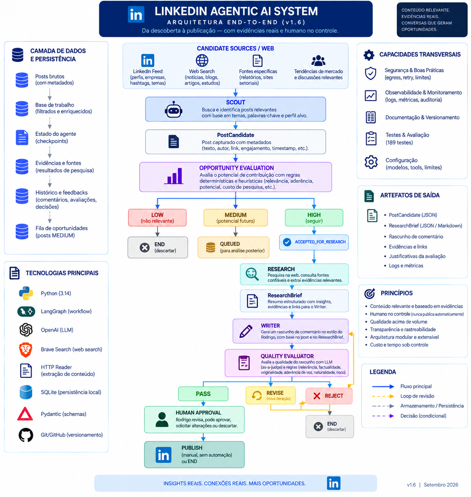

## Architecture Overview

The architecture overview presents the main components, responsibilities, technology boundaries, and relationships that compose the solution.

## End-to-End Agentic Solution Flow

The end-to-end flow shows how an opportunity moves through the agentic solution, from discovery and evaluation to research, writing, quality evaluation, and the final human decision boundary.

Why This Project Exists

Strategic interaction on LinkedIn involves much more than generating text.

A useful system must decide:

which discussions are worth attention;

whether the user can make a relevant and differentiated contribution;

whether additional research is justified;

what evidence is required before making factual claims;

how much external context should be exposed to an LLM;

how to write in the intended professional voice;

whether the generated contribution satisfies a quality contract;

when the system should stop, retry, revise, queue, or escalate;

where deterministic software must retain control instead of delegating decisions to an LLM.

This project explores that problem as a controlled agentic AI system, not as a single prompt and not as an autonomous social-media bot.

The goal is to reduce the manual effort required to discover and prepare high-value professional interactions while preserving human publication authority.

Product Principle

The system is designed around a simple rule:

Opportunity != Popularity

A popular post is not automatically a valuable opportunity.

The system should prioritize situations where the user can make a relevant, differentiated, and professionally useful contribution.

Engagement matters, but it must not dominate contribution potential, professional positioning, topic relevance, evidence quality, or responsible research effort.

Current Architecture

The active architecture is built around a controlled pipeline:

Candidate Sources / Web
        │
        ▼
      SCOUT
        │
        ▼
   PostCandidate
        │
        ▼
OPPORTUNITY EVALUATION
        │
   ┌────┼───────────────┐
   │    │               │
  LOW MEDIUM           HIGH
   │    │               │
   ▼    ▼               ▼
  END  QUEUED   ACCEPTED_FOR_RESEARCH
                        │
                        ▼
                    RESEARCH
                        │
                        ▼
                  ResearchBrief
                        │
                        ▼
                     WRITER
                        │
                        ▼
                QUALITY EVALUATOR
                        │
                ┌───────┼────────┐
                ▼       ▼        ▼
              PASS    REVISE   REJECT
                │       │        │
                ▼       └─► WRITER
          HUMAN / END             │
                                  ▼
                                 END

The HIGH path is integrated through Research and Writer.

The quality revision loop is bounded. A revision returns to Writer rather than rerunning Research.

Publication remains outside autonomous execution.

Responsibility Model

A central architectural decision is to separate semantic reasoning from deterministic operational control.

LLM
├── semantic interpretation
├── bounded action selection
├── evidence interpretation
├── synthesis
└── structured outputs

Python
├── scoring
├── guardrails
├── action authorization
├── provenance enforcement
├── classifications
├── token/context limits
├── counters and budgets
└── factual state transitions

LangGraph
├── shared workflow state
├── node transitions
├── deterministic routing
└── controlled orchestration

Human
└── final publication authority

The guiding principle is:

LLM interprets and decides semantically; Python governs execution and limits; LangGraph governs workflow; the human retains publication authority.

The LLM is used where semantic understanding adds material value.

Deterministic application logic owns decisions that can be expressed reliably as rules.

Scout Agent

Scout is a bounded agentic loop responsible for discovering potentially valuable professional interaction opportunities.

Its action vocabulary is:

SEARCH
READ
SELECT
FINISH

The internal loop follows:

State
  ↓
LLM chooses next allowed action
  ↓
Structured ScoutAction
  ↓
Python validates and authorizes
  ↓
Tool executes
  ↓
Observation updates State
  ↓
Next bounded decision

Semantic Autonomy

The LLM may:

formulate search queries;

choose discovered results to read;

interpret read content;

select a candidate;

continue exploring;

finish.

It does not control the runtime directly.

Every requested action must pass through a typed contract and deterministic authorization.

Deterministic Guardrails

Python enforces rules including:

SEARCH requires a valid query;

repeated searches are rejected;

READ requires an authorized URL;

READ is restricted to URLs returned by search;

visited URLs cannot be revisited;

SELECT requires previously read content;

SELECT requires a structured selection;

duplicate candidate selection is controlled;

unsupported actions are rejected;

exploration is bounded by operational limits.

Recoverable tool failures can become part of agent state so the LLM can make another bounded decision rather than crashing the entire agent loop.

Candidate Selection

Validated content can be promoted into a PostCandidate:

SEARCH
  ↓
READ
  ↓
SELECT
  ↓
Python validation
  ↓
PostCandidate

The semantic decision to select belongs to the LLM.

Factual construction, validation, deduplication, and state mutation belong to Python.

Real Web Tooling

The project supports a provider-neutral web tool contract:

SearchTool
(query: str)
    ↓
list[SearchResult]

ReadTool
(url: str)
    ↓
str

This allows Scout and Research to operate independently from a specific search or reading provider.

Two execution modes are supported:

WEB_TOOL_MODE=fake
WEB_TOOL_MODE=real

Fake Mode

Deterministic fake tools remain available for isolated, reproducible automated testing.

Real Mode

The current real adapters include:

Search
  ↓
Brave Search adapter

Read
  ↓
HTTP reader

The real tooling layer includes bounded network behavior and controlled failure handling.

Infrastructure failures are represented through a dedicated WebToolError, allowing the agent runtime to distinguish external tool failures from programming errors.

Reader Safety

The HTTP reader includes controls such as:

HTTP/HTTPS validation;

localhost rejection;

DNS resolution;

rejection of private/non-global destinations;

redirect limits;

redirect revalidation;

request timeouts;

content-type validation;

response-size limits;

controlled HTTP/network error conversion.

These controls reduce the attack surface created by allowing an agent to request arbitrary web reads.

Main Content Extraction

Raw HTML is not passed directly to downstream LLM reasoning.

The reader extracts useful textual content while suppressing common page chrome and irrelevant structures.

Ignored structures include elements such as:

nav
header
footer
aside
script
style
form
noscript

When semantic containers are available, the reader prioritizes:

<article>
<main>

When they are absent, content-density scoring can select useful section or div containers based on signals such as:

text length;

paragraph count;

heading count;

list-item count;

link density;

positive content hints;

negative navigation/promotion hints.

The goal is not universal webpage extraction.

The goal is to provide a bounded, dependency-light extraction layer that materially reduces menus, navigation, cookie banners, promotional blocks, and other boilerplate before content reaches the agent.

Context Preparation

External content is normalized and bounded before it enters LLM-facing context.

The Context Preparation layer:

Raw external text
        │
        ▼
Normalize
        │
        ▼
Remove exact duplicate lines
        │
        ▼
Count tokens
        │
        ▼
Apply component budget
        │
        ▼
PreparedContext

PreparedContext records:

content
original_tokens
prepared_tokens
truncated

Current configured read-context budgets include:

Scout read context
    max 1800 tokens

Research read context
    max 2500 tokens per read

Research cumulative stored read context
    max 8000 tokens

The cumulative Research budget applies to stored read content rather than the entire serialized prompt.

This boundary exists for cost, latency, predictability, context hygiene, and protection against accidentally injecting arbitrarily large external pages into LLM calls.

Opportunity Evaluation

Opportunity Evaluation answers:

Is this discovered post a strategically valuable opportunity to contribute?

It is intentionally different from content quality evaluation.

The current dimensions are:

Dimension

Weight

Contribution Potential

30%

Positioning Fit

25%

Topic Relevance

20%

Engagement Potential

15%

Research Efficiency

10%

Where:

Research Efficiency = 100 - Research Cost

The deterministic score is:

Opportunity Score =
    Contribution Potential × 0.30
  + Positioning Fit        × 0.25
  + Topic Relevance        × 0.20
  + Engagement Potential   × 0.15
  + Research Efficiency    × 0.10

Semantic vs Deterministic Evaluation

The LLM evaluates semantic signals:

topic_relevance
positioning_fit
contribution_potential
research_cost

Python owns:

research_efficiency
weighted opportunity score
mandatory guardrails
final HIGH / MEDIUM / LOW classification

The LLM therefore does not silently own the final operational routing decision.

Guardrails

The current guardrails force LOW when:

Contribution Potential < 30
Positioning Fit        < 30
Topic Relevance        < 25

If no guardrail is triggered:

HIGH   = score >= 80
MEDIUM = score >= 60 and < 80
LOW    = score < 60

These weights and thresholds are initial product hypotheses and should eventually be calibrated using real opportunities and observed outcomes.

Engagement Potential

Objective engagement scoring is intentionally not invented.

The current workflow uses a neutral placeholder where reliable engagement metadata is unavailable:

DEFAULT_ENGAGEMENT_POTENTIAL = 50

This is not a production engagement formula.

Opportunity Routing

Opportunity routing is deterministic:

HIGH
  ↓
ACCEPTED_FOR_RESEARCH
  ↓
Research

MEDIUM
  ↓
QUEUED
  ↓
END

LOW
  ↓
END

ACCEPTED_FOR_RESEARCH represents an explicit workflow transition and leads into the integrated Research capability.

MEDIUM is intentionally distinct from LOW so potentially useful opportunities can be preserved without automatically consuming Research inference.

The longer-term lifecycle of queued MEDIUM opportunities remains an open calibration decision.

Research Capability

Research is a bounded evidence-gathering agent.

Its purpose is:

Transform an approved opportunity into the minimum evidence package required for a factual, defensible, and useful Writer contribution.

Its action vocabulary is:

SEARCH
READ
EXTRACT
FINISH

The evidence chain is deliberately explicit:

SEARCH
  ↓
READ
  ↓
EXTRACT
  ↓
EvidenceItem
  ↓
ResearchBrief

Only extracted evidence is allowed to support Writer-facing factual findings.

Semantic Responsibility

The LLM may determine:

the research objective;

focus areas;

search strategy;

which authorized sources to read;

which claims are worth extracting;

whether evidence appears sufficient;

synthesis of findings;

counterpoints;

unresolved questions.

Deterministic Responsibility

Python owns:

action authorization;

URL provenance;

source state;

search/read/evidence counters;

operational limits;

context budgets;

factual state mutation;

final brief construction.

Bounded Runtime

Research is bounded by limits including:

max steps          = 10
max decisions      = 12
max searches       = 3
max reads          = 5
max evidence items = 6

Context budgets provide an additional independent boundary.

Research can terminate with states including:

SUFFICIENT
INSUFFICIENT
LIMIT_REACHED

The current workflow preserves the bounded Research result for downstream use.

Differentiated routing based on these statuses may be hardened further in a later increment.

Evidence and Provenance

Research separates discovered sources, read sources, and extracted evidence.

Conceptually:

Search result
    │
    ▼
Authorized URL
    │
    ▼
ReadSource
    │
    ▼
EvidenceItem
    │
    ▼
ResearchBrief

This is intentional.

A search snippet is not automatically treated as evidence.

A source being read is not automatically sufficient to support a claim.

Evidence must be explicitly extracted and retain provenance.

This boundary helps prevent the Writer from receiving unsupported factual conclusions that merely appeared somewhere in agent state.

Writer

Writer is responsible for generating the contribution itself.

It does not own:

opportunity classification;

research authorization;

evidence provenance;

quality routing;

publication.

The orchestration layer maps global workflow state into component-specific Writer input rather than exposing the entire state indiscriminately.

This keeps component dependencies explicit and limits unnecessary coupling.

Research output can therefore inform Writer without turning Writer into a second research agent.

Quality Evaluator

Opportunity Evaluation and Quality Evaluation solve different problems:

Opportunity Evaluation
        │
        ▼
"Should we contribute here?"

            vs.

Quality Evaluator
        │
        ▼
"Is this generated contribution good enough?"

Quality routing is deterministic:

PASS
  ↓
Human / END

REVISE
  ↓
Writer
  ↓
Quality Evaluator

REJECT
  ↓
END

Revision loops are bounded by a maximum iteration limit.

A Writer revision does not automatically rerun Research.

Human-in-the-loop

Human publication authority is mandatory.

The system is designed to assist with:

discovery
    ↓
prioritization
    ↓
research
    ↓
writing
    ↓
quality evaluation

but not autonomous publication.

The product boundary is:

AI prepares
AI evaluates
Human decides

Autonomous LinkedIn publication and autonomous commenting are explicit non-goals.

Structured Outputs and Data Contracts

Typed contracts are used at AI and component boundaries where practical.

Important contracts include concepts such as:

PostCandidate

OpportunitySignals
OpportunityEvaluation

ScoutAction
ScoutSelection
ScoutState

SearchResult
SearchTool
ReadTool

ResearchObjective
ResearchAction
ReadSource
EvidenceItem
ResearchState
ResearchBriefSynthesis
ResearchBrief

Writer input/output contracts

Quality Evaluation contracts

LinkedInAgentState

Pydantic is used to make component boundaries explicit and machine-validatable.

The architecture favors component-specific inputs over passing the complete orchestration state directly into every specialist component.

State and Routing

The LangGraph layer is intentionally kept thin.

Schemas
  ↓
define data contracts

State
  ↓
carries validated working data

Nodes
  ↓
invoke components and map state

Routing
  ↓
chooses controlled paths

Graph
  ↓
connects the workflow

Business intelligence, semantic reasoning, scoring, evidence rules, and tool behavior should remain in their responsible components rather than being duplicated inside graph nodes.

Real-World Validation

The system has moved beyond fake-tool-only validation.

Scout

Scout has been executed with:

real OpenAI reasoning
+
real web search
+
real HTTP reading
+
main-content extraction
+
bounded context preparation

A real smoke run successfully:

formulated a search query;

discovered a current supply-chain / agentic-AI discussion;

selected a source;

read it through the real reader;

extracted editorial content;

created a candidate;

completed without a tool error.

Research

Research has also been exercised with real web tooling.

A real smoke run successfully:

accepted an approved opportunity;

generated a research objective;

searched real sources;

read authorized sources;

extracted evidence with provenance;

produced a ResearchBrief;

distinguished evidence from unresolved questions;

completed with a sufficient research status.

These smoke validations demonstrate real tool integration.

They are not equivalent to production readiness or exhaustive end-to-end validation.

Engineering Principles

human-in-the-loop before publication;

no autonomous publishing;

bounded agent autonomy;

structured outputs between AI components;

explicit workflow state;

deterministic guardrails;

deterministic logic where rules provide sufficient reliability;

LLM reasoning where semantic understanding adds material value;

bounded retries, revisions, searches, reads, and exploration;

factual data must not be invented by an LLM;

external content must be bounded before entering LLM context;

evidence must retain provenance;

semantic interpretation and operational decisions remain separated;

component responsibility boundaries must remain explicit;

external tool failures should fail in controlled ways;

security boundaries must be applied to agent-accessible network tools;

complexity is added only when it provides clear product or behavioral value.

Cost-Aware Orchestration

LLM consumption is treated as computational infrastructure.

The orchestration question is not only:

Which component should run?

It is also:

Which model and context budget are appropriate for this task?

The optimization principle is:

Use the lowest inference cost capable of satisfying the required quality contract.

Frontier models should be reserved for tasks where their additional reasoning capability materially improves the result.

Deterministic logic, bounded context, and cheaper models should be preferred whenever they can satisfy the requirement reliably.

This principle is expected to evolve into broader token governance and model-routing capabilities as the system matures.

Tech Stack

Current core technologies include:

Python;

OpenAI API;

LangGraph;

Pydantic;

pytest;

httpx;

tiktoken;

Brave Search API for the current real search adapter;

environment-based configuration.

The architecture intentionally keeps search and read interfaces provider-neutral so infrastructure can evolve without rewriting Scout or Research contracts.

Testing

The current automated baseline is:

189 passing tests

The suite covers behavior across areas including:

Writer;

Quality Evaluator;

quality scoring and routing;

schema validation;

Opportunity Evaluation;

Research Efficiency;

opportunity guardrails and classifications;

workflow transitions;

Scout behavior and authorization;

Scout → Opportunity integration;

Research contracts and runtime behavior;

Research → Writer integration;

web tool selection;

Brave Search adapter behavior;

HTTP reader behavior;

web-tool recovery;

SSRF/network guardrails;

context preparation;

Scout context boundaries;

Research per-read and cumulative context boundaries;

main-content extraction;

content-density extraction.

Automated tests are designed not to depend on live OpenAI or live web calls where deterministic isolation is more appropriate.

Real smoke tests complement the automated suite for infrastructure boundaries that require actual external services.

Current Status

Implemented and validated

Bounded Scout Agent
Scout → Opportunity Integration
Opportunity Evaluation v0.1
Deterministic Opportunity Routing
Bounded Research Capability
Research → Writer Integration
Writer
Quality Evaluator
Controlled Quality Revision Loop
Structured AI Contracts
Real/Fake Web Tool Selection
Brave Search Adapter
Bounded HTTP Reader
Web Tool Failure Recovery
Main Content Extraction
Content Density Extraction
Context Preparation
Per-component Token Budgets
Research Evidence Provenance
Deterministic Guardrails
Human Publication Boundary
Project Audit / Recovery Discipline

Intentionally incomplete

Full production LinkedIn discovery
Reliable LinkedIn engagement metadata
Objective Engagement Potential formula
Multiple-candidate orchestration
Production-grade observability
Production deployment architecture
Long-term model routing / token governance
Calibration from real-world outcomes
Fully validated real end-to-end workflow
Autonomous publication — intentionally excluded

Next Development Increment

The next planned capability is:

End-to-End Real Workflow Validation v0.1

The objective is to validate the integrated path with real external tooling and real model behavior across the workflow boundary rather than validating Scout and Research only through isolated smoke tests.

Conceptually:

Real discovery
    ↓
Scout
    ↓
Opportunity Evaluation
    ↓
HIGH
    ↓
Research
    ↓
Writer
    ↓
Quality Evaluation
    ↓
Human / END boundary

The validation should preserve all existing guardrails and make failures observable rather than bypassing them for the sake of a successful demo.

Known Limitations

real web search is available, but production LinkedIn-specific discovery remains unresolved;

reliable LinkedIn engagement metadata has not been established;

Engagement Potential still uses a temporary neutral value where objective data is unavailable;

multiple distinct Scout candidates are not yet orchestrated through a ranking/queue strategy;

the Scout runtime does not yet provide production-grade chronological observability;

Research status routing can be hardened further;

main-content extraction is heuristic and is not intended to solve every webpage layout;

the real search adapter currently depends on Brave Search, although the internal contract is provider-neutral;

production-grade cost, latency, and decision telemetry are not yet complete;

cloud deployment architecture is not yet established;

the complete real workflow still requires explicit end-to-end validation.

These limitations are documented rather than hidden because the project is being developed as a sequence of validated capabilities.

Explicit Non-Goals

autonomous LinkedIn publication;

autonomous LinkedIn commenting;

unbounded browsing;

unbounded agent loops;

unbounded agent-to-agent delegation;

allowing an LLM to bypass deterministic guardrails;

allowing arbitrary external content to enter LLM context without limits;

treating search snippets as authoritative evidence;

inventing objective engagement data;

hiding infrastructure failures behind fabricated results;

prematurely optimizing scoring weights without operational evidence.

Development Discipline

Relevant increments are closed through a recoverable checkpoint process:

Implement
  ↓
Run full test suite
  ↓
Generate and validate project audit
  ↓
Update PROJECT_CONTEXT.md
  ↓
Review Git diff/status
  ↓
Stage
  ↓
Commit
  ↓
Push

The repository uses:

code
+
tests
+
project audit
+
PROJECT_CONTEXT.md
+
Git checkpoints

as a development recovery mechanism.

The audit is the factual repository snapshot.

PROJECT_CONTEXT.md is the human-maintained interpretation of that state and records baseline lineage, current WIP, established decisions, limitations, and the next planned capability.

Documentation Structure

Architecture documentation is maintained under:

docs/architecture/

Its intended responsibilities are:

01_system_overview.md
    high-level architectural model

02_current_architecture.md
    factual implemented architecture

03_data_model.md
    schemas, contracts, and state relationships

04_decision_log.md
    established architectural decisions

05_cloud_deployment.md
    deployment/runtime architecture when established

06_opportunity_evaluation.md
    deep-dive specification of Opportunity Evaluation

Development recovery context is maintained separately in:

docs/context/PROJECT_CONTEXT.md

This separation prevents the README from becoming the sole source of architectural truth while keeping the repository understandable to a new reader.

Project Philosophy

This project is not intended to demonstrate that an LLM can generate a LinkedIn comment.

The more interesting engineering problem is controlling:

when AI should reason;

when deterministic software should decide;

how autonomous exploration should be bounded;

how external tools should be exposed safely;

how evidence should preserve provenance;

how much context an LLM should receive;

how state should move through the system;

how quality should be evaluated and revised;

where human authority must remain final.

That distinction is the foundation of the architecture.