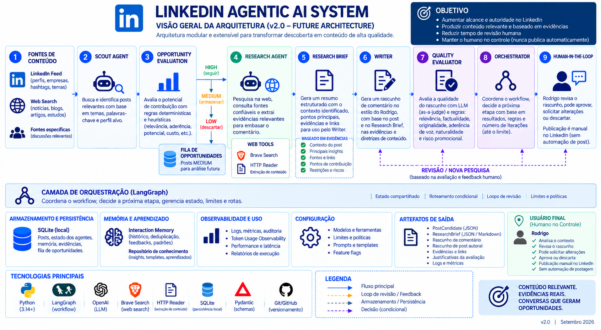

# LinkedIn Agentic AI System

Sistema agentic para identificar oportunidades relevantes no LinkedIn,
pesquisar evidências, gerar comentários alinhados ao estilo do Rodrigo,
avaliar qualidade e encaminhar o resultado para revisão humana.

## Objetivo

Reduzir o esforço manual de pesquisa e preparação de comentários estratégicos
no LinkedIn, preservando controle humano sobre qualquer publicação.

## Arquitetura

Scout → Opportunity Scoring → Research → Writer → Evaluator
→ Orchestrator → Human-in-the-loop

## Princípios

- autonomia delimitada
- human approval obrigatório
- grounded research
- structured outputs
- deterministic guardrails
- observability and evaluation
- no autonomous publishing

## Stack

- Python
- OpenAI
- LangGraph
- Pydantic
- Web Search
- SQLite
- pytest

## Status

v0.1.0 — Project scaffolding