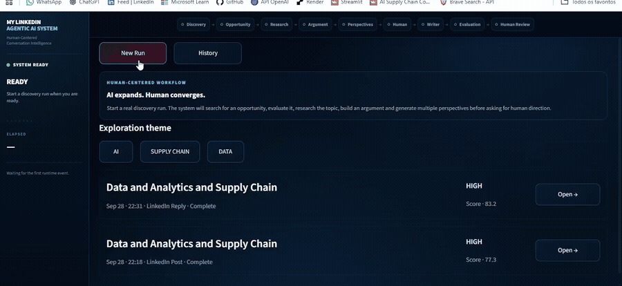

# My LinkedIn Agentic AI System

🚀 **Current Release:** Human-Centered Conversation Intelligence MVP  
🌐 **Live Application:** [Launch My LinkedIn Agentic AI System](https://linkedin-agentic-ai-system.onrender.com/)

A controlled, human-centered agentic AI system for discovering strategically relevant professional conversations, gathering evidence, developing defensible intellectual directions, materializing human-selected perspectives into content, evaluating quality, and preserving human intellectual and publication authority.

**Current stage:** Human-Centered Conversation Intelligence MVP implemented with editable Theme / Intent, Argument Intelligence, Perspective Generation, Human Perspective Selection, Human Content Mode Selection, Final Human Refinement, bilingual presentation, Run History / Product Memory, and a 437-test automated baseline. A real HIGH end-to-end path has been validated through workflow completion. Cloud Deployment is implemented and smoke validated on Render with durable Supabase PostgreSQL persistence.

## Architecture Overview


The architecture overview presents the current solution structure,
including discovery, opportunity evaluation, research, argument
intelligence, perspective generation, Human-in-the-Loop decision
boundaries, content generation, quality evaluation, persistence, and
manual publication.

## Human-Centered Agentic Flow


The human-centered flow makes the operating model explicit: AI expands
the search and reasoning space, the human converges on the intellectual
direction and content mode, AI materializes that decision, and the human
retains final editorial and publication authority.

**AI expands → Human converges → AI materializes → Human owns**

## System in Action

Watch the human-centered agentic workflow in action — from opportunity discovery and research to human decision-making, content generation, and final review.

<p align="center">
  
</p>

## Why This Project Exists

Strategic interaction on LinkedIn involves much more than generating
text.

A useful system must decide:

which discussions are worth attention;

whether the user can make a relevant and differentiated contribution;

whether additional research is justified;

what evidence is required before making factual claims;

how much external context should be exposed to an LLM;

how to write in the intended professional voice;

whether the generated contribution satisfies a quality contract;

when the system should stop, retry, revise, queue, or escalate;

where deterministic software must retain control instead of delegating
decisions to an LLM.

This project explores that problem as a controlled agentic AI system,
not as a single prompt and not as an autonomous social-media bot.

The goal is to reduce the manual effort required to discover and prepare
high-value professional interactions while preserving human publication
authority.

## Product Principle

The system is designed around a simple rule:

Opportunity != Popularity

A popular post is not automatically a valuable opportunity.

The system should prioritize situations where the user can make a
relevant, differentiated, and professionally useful contribution.

Engagement matters, but it must not dominate contribution potential,
professional positioning, topic relevance, evidence quality, or
responsible research effort.

## Current Architecture

The active architecture is built around a controlled, human-centered
pipeline:

``` text
Human Theme / Intent
        │
        ▼
Candidate Sources / Web
        │
        ▼
      SCOUT
        │
        ▼
   PostCandidate
        │
        ▼
OPPORTUNITY EVALUATION
        │
   ┌────┼───────────────┐
   │    │               │
  LOW  MEDIUM           HIGH
   │    │               │
   ▼    ▼               ▼
  END  QUEUED   ACCEPTED_FOR_RESEARCH
                        │
                        ▼
                     RESEARCH
                        │
                        ▼
                  ResearchBrief
                        │
                        ▼
              ARGUMENT INTELLIGENCE
                        │
                        ▼
                   ArgumentBrief
                        │
                        ▼
              PERSPECTIVE GENERATION
                        │
                        ▼
                  PerspectiveSet
                        │
                        ▼
          HUMAN PERSPECTIVE SELECTION
                        │
                        ▼
                SelectedPerspective
                        │
                        ▼
          HUMAN CONTENT MODE SELECTION
                        │
                        ▼
                   ContentMode
                        │
                        ▼
                      WRITER
                        │
                        ▼
                QUALITY EVALUATOR
                        │
             ┌──────────┼──────────┐
             ▼          ▼          ▼
           PASS       REVISE     REJECT
             │          │          │
             │          └─► WRITER ▼
             │               │     END
             │               └─► QUALITY EVALUATOR
             ▼
          HUMAN FINAL REFINEMENT
             │                 │
           ACCEPT            REFINE
             │                 │
             │                 └─► WRITER
             │                       │
             └───────────┬───────────┘
                         ▼
                 WORKFLOW COMPLETE
                         │
              ┌──────────┴──────────┐
              ▼                     ▼
    TRANSLATION ON DEMAND      MANUAL PUBLICATION
    presentation layer only    outside autonomy
```

The HIGH path is integrated through Research, Argument Intelligence,
Perspective Generation, explicit human intellectual convergence, Writer,
Quality Evaluator, and Final Human Refinement.

The quality revision loop is bounded. A `REVISE` decision returns to
Writer rather than rerunning Research.

Final Human Refinement is a separate Human-in-the-Loop boundary.
`ACCEPT` completes with the approved draft. `REFINE` provides bounded
final editorial guidance for one final Writer pass and then completes
the workflow; it does not create another automatic Quality Evaluator
loop.

Translation is an on-demand presentation capability. The canonical
reasoning pipeline remains English-first, and translation does not
mutate reasoning artifacts or workflow routing.

Publication remains outside autonomous execution.

## Responsibility Model

A central architectural decision is to separate semantic reasoning from
deterministic operational control while preserving explicit human
intellectual authority.

``` text
LLM
├── semantic interpretation
├── bounded action selection
├── evidence interpretation
├── synthesis
├── argument development
├── perspective generation
├── writing
└── structured outputs

Python
├── scoring
├── guardrails
├── action authorization
├── provenance enforcement
├── classifications
├── token/context limits
├── counters and budgets
└── factual state transitions

LangGraph
├── shared workflow state
├── node transitions
├── deterministic routing
├── Human-in-the-Loop interrupt / resume
└── controlled orchestration

Human
├── theme / intent
├── perspective selection
├── content-mode selection
├── contextual guidance
├── final editorial judgment
└── publication authority
```

The guiding principle is:

**LLMs interpret and expand semantically; Python governs execution and
limits; LangGraph governs workflow; the human converges, owns the
intellectual direction, and retains publication authority.**

The LLM is used where semantic understanding adds material value.

Deterministic application logic owns decisions that can be expressed
reliably as rules.

## Scout Agent

Scout is a bounded agentic loop responsible for discovering potentially
valuable professional interaction opportunities.

Its action vocabulary is:

``` text
SEARCH · READ · SELECT · FINISH
```

The internal loop follows:

``` text
State
  ↓
LLM chooses next allowed action
  ↓
Structured ScoutAction
  ↓
Python validates and authorizes
  ↓
Tool executes
  ↓
Observation updates State
  ↓
Next bounded decision
```

### Semantic Autonomy

The LLM may:

formulate search queries;

choose discovered results to read;

interpret read content;

select a candidate;

continue exploring;

finish.

It does not control the runtime directly.

Every requested action must pass through a typed contract and
deterministic authorization.

### Deterministic Guardrails

Python enforces rules including:

SEARCH requires a valid query;

repeated searches are rejected;

READ requires an authorized URL;

READ is restricted to URLs returned by search;

visited URLs cannot be revisited;

SELECT requires previously read content;

SELECT requires a structured selection;

duplicate candidate selection is controlled;

unsupported actions are rejected;

exploration is bounded by operational limits.

Recoverable tool failures can become part of agent state so the LLM can
make another bounded decision rather than crashing the entire agent
loop.

### Candidate Selection

Validated content can be promoted into a PostCandidate:

SEARCH ↓ READ ↓ SELECT ↓ Python validation ↓ PostCandidate

    The semantic decision to select belongs to the LLM.

    Factual construction, validation, deduplication, and state mutation belong to Python.

    Real Web Tooling

    The project supports a provider-neutral web tool contract:

    ```text
    SearchTool
    (query: str)
        ↓
    list[SearchResult]

    ReadTool
    (url: str)
        ↓
    str

This allows Scout and Research to operate independently from a specific
search or reading provider.

Two execution modes are supported:

WEB_TOOL_MODE=fake WEB_TOOL_MODE=real

Fake Mode

Deterministic fake tools remain available for isolated, reproducible
automated testing.

Real Mode

The current real adapters include:

``` text
Search
  ↓
Brave Search adapter

Read
  ↓
HTTP reader
```

The real tooling layer includes bounded network behavior and controlled
failure handling.

Infrastructure failures are represented through a dedicated
WebToolError, allowing the agent runtime to distinguish external tool
failures from programming errors.

Reader Safety

The HTTP reader includes controls such as:

HTTP/HTTPS validation;

localhost rejection;

DNS resolution;

rejection of private/non-global destinations;

redirect limits;

redirect revalidation;

request timeouts;

content-type validation;

response-size limits;

controlled HTTP/network error conversion.

These controls reduce the attack surface created by allowing an agent to
request arbitrary web reads.

Main Content Extraction

Raw HTML is not passed directly to downstream LLM reasoning.

The reader extracts useful textual content while suppressing common page
chrome and irrelevant structures.

Ignored structures include elements such as:

nav header footer aside script style form noscript

When semantic containers are available, the reader prioritizes:

```{=html}
<article>
```
```{=html}
<main>
```
When they are absent, content-density scoring can select useful section
or div containers based on signals such as:

text length;

paragraph count;

heading count;

list-item count;

link density;

positive content hints;

negative navigation/promotion hints.

The goal is not universal webpage extraction.

The goal is to provide a bounded, dependency-light extraction layer that
materially reduces menus, navigation, cookie banners, promotional
blocks, and other boilerplate before content reaches the agent.

Context Preparation

External content is normalized and bounded before it enters LLM-facing
context.

The Context Preparation layer:

``` text
Raw external text
        │
        ▼
Normalize
        │
        ▼
Remove exact duplicate lines
        │
        ▼
Count tokens
        │
        ▼
Apply component budget
        │
        ▼
PreparedContext
```

PreparedContext records:

content original_tokens prepared_tokens truncated

Current configured read-context budgets include:

Scout read context max 1800 tokens

Research read context max 2500 tokens per read

Research cumulative stored read context max 8000 tokens

The cumulative Research budget applies to stored read content rather
than the entire serialized prompt.

This boundary exists for cost, latency, predictability, context hygiene,
and protection against accidentally injecting arbitrarily large external
pages into LLM calls.

``` text
## Opportunity Evaluation

Opportunity Evaluation answers:

Is this discovered post a strategically valuable opportunity to contribute?

It is intentionally different from content quality evaluation.

The current dimensions are:

Dimension

Weight

Contribution Potential

30%

Positioning Fit

25%

Topic Relevance

20%

### Engagement Potential

15%

Research Efficiency

10%

Where:

Research Efficiency = 100 - Research Cost

The deterministic score is:

```text
Opportunity Score =
    Contribution Potential × 0.30
  + Positioning Fit        × 0.25
  + Topic Relevance        × 0.20
  + Engagement Potential   × 0.15
  + Research Efficiency    × 0.10
```

### Semantic vs Deterministic Evaluation

The LLM evaluates semantic signals:

topic_relevance positioning_fit contribution_potential research_cost

Python owns:

research_efficiency weighted opportunity score mandatory guardrails
final HIGH / MEDIUM / LOW classification

The LLM therefore does not silently own the final operational routing
decision.

### Guardrails

The current guardrails force LOW when:

Contribution Potential \< 30 Positioning Fit \< 30 Topic Relevance \< 25

If no guardrail is triggered:

HIGH = score \>= 80 MEDIUM = score \>= 60 and \< 80 LOW = score \< 60

These weights and thresholds are initial product hypotheses and should
eventually be calibrated using real opportunities and observed outcomes.

### Engagement Potential

Objective engagement scoring is intentionally not invented.

The current workflow uses a neutral placeholder where reliable
engagement metadata is unavailable:

DEFAULT_ENGAGEMENT_POTENTIAL = 50

This is not a production engagement formula.

## Opportunity Routing

Opportunity routing is deterministic:

``` text
HIGH
  ↓
ACCEPTED_FOR_RESEARCH
  ↓
Research

MEDIUM
  ↓
QUEUED
  ↓
END
```

LOW ↓ END

ACCEPTED_FOR_RESEARCH represents an explicit workflow transition and
leads into the integrated Research capability.

MEDIUM is intentionally distinct from LOW so potentially useful
opportunities can be preserved without automatically consuming Research
inference.

The longer-term lifecycle of queued MEDIUM opportunities remains an open
calibration decision.

## Research Capability

Research is a bounded evidence-gathering agent.

Its purpose is:

Transform an approved opportunity into the minimum evidence package
required for a factual, defensible, and useful Writer contribution.

Its action vocabulary is:

`SEARCH` · `READ` · `EXTRACT` · `FINISH`

The evidence chain is deliberately explicit:

SEARCH ↓ READ ↓ EXTRACT ↓ EvidenceItem ↓ ResearchBrief

    Only extracted evidence is allowed to support Writer-facing factual findings.

    Semantic Responsibility

    The LLM may determine:

    the research objective;

    focus areas;

    search strategy;

    which authorized sources to read;

    which claims are worth extracting;

    whether evidence appears sufficient;

    synthesis of findings;

    counterpoints;

    unresolved questions.

    Deterministic Responsibility

    Python owns:

    action authorization;

    URL provenance;

    source state;

    search/read/evidence counters;

    operational limits;

    context budgets;

    factual state mutation;

    final brief construction.

    Bounded Runtime

    Research is bounded by limits including:

    max steps          = 10
    max decisions      = 12
    max searches       = 3
    max reads          = 5
    max evidence items = 6

    Context budgets provide an additional independent boundary.

    Research can terminate with states including:

    SUFFICIENT
    INSUFFICIENT
    LIMIT_REACHED

    The current workflow preserves the bounded Research result for downstream use.

    Differentiated routing based on these statuses may be hardened further in a later increment.

    Evidence and Provenance

    Research separates discovered sources, read sources, and extracted evidence.

    Conceptually:

    ```text
    Search result
        │
        ▼
    Authorized URL
        │
        ▼
    ReadSource
        │
        ▼
    EvidenceItem
        │
        ▼
    ResearchBrief

This is intentional.

A search snippet is not automatically treated as evidence.

A source being read is not automatically sufficient to support a claim.

Evidence must be explicitly extracted and retain provenance.

This boundary helps prevent the Writer from receiving unsupported
factual conclusions that merely appeared somewhere in agent state.

## Argument Intelligence

Argument Intelligence transforms the validated `ResearchBrief` into a
structured intellectual foundation for downstream perspective
generation.

``` text
ResearchBrief
     │
     ▼
Argument Intelligence
     │
     ▼
ArgumentBrief
```

Its purpose is not to choose the user's position.

It organizes the evidence and argument space so that downstream
generation can produce materially distinct, defensible intellectual
directions grounded in the researched opportunity.

The `ArgumentBrief` therefore acts as a bridge between evidence
gathering and authorial reasoning.

## Perspective Generation

Perspective Generation expands the `ArgumentBrief` into a
`PerspectiveSet` containing materially distinct and defensible
directions.

``` text
ArgumentBrief
     │
     ▼
Perspective Generation
     │
     ▼
PerspectiveSet
```

This stage deliberately expands the intellectual search space.

It does not autonomously decide which perspective the user should adopt.

That authority belongs to the next Human-in-the-Loop boundary.

## Human Perspective Selection

The human reviews the generated `PerspectiveSet` and selects the
intellectual direction that is worth owning.

``` text
PerspectiveSet
     │
     ▼
Human Perspective Selection
     │
     ▼
SelectedPerspective
```

This boundary is central to the product thesis.

The system can research, structure arguments, and propose alternatives,
but the user's intellectual position is not delegated to the model.

The selected perspective is preserved explicitly in workflow state and
passed to Writer.

## Human Content Mode Selection

After selecting the intellectual direction, the human chooses how that
direction should be materialized.

Current supported content modes are:

``` text
linkedin_post
linkedin_reply
article
```

The selected `ContentMode` is an explicit workflow artifact.

This keeps two decisions separate:

``` text
What is worth saying?
        ↓
SelectedPerspective

How should it be materialized?
        ↓
ContentMode
```

Both remain human decisions.

## Writer

Writer is responsible for materializing the human-selected perspective
into the human-selected content mode.

It does not own:

opportunity classification;

research authorization;

evidence provenance;

quality routing;

publication.

The orchestration layer maps global workflow state into
component-specific Writer input rather than exposing the entire state
indiscriminately.

This keeps component dependencies explicit and limits unnecessary
coupling.

Research and Argument Intelligence can therefore inform Writer without
turning Writer into a second research agent or allowing it to choose the
user's intellectual position.

## Quality Evaluator

Opportunity Evaluation and Quality Evaluation solve different problems:

``` text
Opportunity Evaluation
│
▼
"Should we contribute here?"

            vs.

Quality Evaluator
│
▼
"Is this generated content good enough?"
```

Quality routing is deterministic:

``` text
PASS
  ↓
Human Final Refinement

REVISE
  ↓
Writer
  ↓
Quality Evaluator

REJECT
  ↓
END
```

Revision loops are bounded by a maximum iteration limit.

A Writer revision does not automatically rerun Research, Argument
Intelligence, or Perspective Generation.

## Human-in-the-Loop

Human authority is distributed across the workflow rather than being
reduced to a final approval button.

The current MVP contains explicit human decision boundaries for:

``` text
Theme / Intent
      ↓
Perspective Selection
      ↓
Content Mode Selection
      ↓
Final Human Refinement
      ↓
Manual Publication
```

### Human Perspective Selection

AI expands researched evidence into multiple defensible perspectives.

The human chooses the intellectual direction before Writer materializes
it.

### Human Content Mode Selection

The human chooses whether the selected perspective should become a
`linkedin_post`, `linkedin_reply`, or `article`.

### Final Human Refinement

After Quality Evaluator `PASS`, control returns to the human.

``` text
PASS
  ↓
Human Final Refinement
  ├── ACCEPT → WORKFLOW COMPLETE
  └── REFINE → Writer → WORKFLOW COMPLETE
```

`REFINE` provides bounded final editorial guidance for one final Writer
pass.

It intentionally does not create another automatic Quality Evaluator
loop.

### Manual Publication

Publication remains outside autonomous execution.

The product boundary is:

``` text
AI expands
Human converges
AI materializes
Human owns
```

Autonomous LinkedIn publication and autonomous commenting remain
explicit non-goals.

## Structured Outputs and Data Contracts

Typed contracts are used at AI and component boundaries where practical.

Important contracts include concepts such as:

PostCandidate

OpportunitySignals OpportunityEvaluation

ScoutAction ScoutSelection ScoutState

SearchResult SearchTool ReadTool

ResearchObjective ResearchAction ReadSource EvidenceItem ResearchState
ResearchBriefSynthesis ResearchBrief

ArgumentBrief PerspectiveSet SelectedPerspective ContentMode

Writer input/output contracts

Quality Evaluation contracts

LinkedInAgentState

Pydantic is used to make component boundaries explicit and
machine-validatable.

The architecture favors component-specific inputs over passing the
complete orchestration state directly into every specialist component.

## State and Routing

The LangGraph layer is intentionally kept thin.

``` text
Schemas
  ↓
define data contracts

State
  ↓
carries validated working data

Nodes
  ↓
invoke components and map state

Routing
  ↓
chooses controlled paths

Graph
  ↓
connects the workflow
```

Business intelligence, semantic reasoning, scoring, evidence rules, and
tool behavior should remain in their responsible components rather than
being duplicated inside graph nodes.

## Real-World Validation

The system has moved beyond fake-tool-only validation.

Scout

Scout has been executed with:

real OpenAI reasoning + real web search + real HTTP reading +
main-content extraction + bounded context preparation

A real smoke run successfully:

formulated a search query;

discovered a current supply-chain / agentic-AI discussion;

selected a source;

read it through the real reader;

extracted editorial content;

created a candidate;

completed without a tool error.

Research

Research has also been exercised with real web tooling.

A real smoke run successfully:

accepted an approved opportunity;

generated a research objective;

searched real sources;

read authorized sources;

extracted evidence with provenance;

produced a ResearchBrief;

distinguished evidence from unresolved questions;

completed with a sufficient research status.

These smoke validations demonstrate real tool integration.

They are not equivalent to production readiness or exhaustive end-to-end
validation.

## Engineering Principles

human-in-the-loop before publication;

no autonomous publishing;

bounded agent autonomy;

structured outputs between AI components;

explicit workflow state;

deterministic guardrails;

deterministic logic where rules provide sufficient reliability;

LLM reasoning where semantic understanding adds material value;

bounded retries, revisions, searches, reads, and exploration;

factual data must not be invented by an LLM;

external content must be bounded before entering LLM context;

evidence must retain provenance;

semantic interpretation and operational decisions remain separated;

component responsibility boundaries must remain explicit;

external tool failures should fail in controlled ways;

security boundaries must be applied to agent-accessible network tools;

complexity is added only when it provides clear product or behavioral
value.

## Cost-Aware Orchestration

LLM consumption is treated as computational infrastructure.

The orchestration question is not only:

Which component should run?

It is also:

Which model and context budget are appropriate for this task?

The optimization principle is:

Use the lowest inference cost capable of satisfying the required quality
contract.

Frontier models should be reserved for tasks where their additional
reasoning capability materially improves the result.

Deterministic logic, bounded context, and cheaper models should be
preferred whenever they can satisfy the requirement reliably.

This principle has now evolved into an initial **Token Governance v0.1**
capability with run-scoped usage observability across the main LLM and
context boundaries. Model routing remains a future capability.

## Interaction Memory

Scout now includes persistent Interaction Memory backed by SQLite.

The current memory layer records canonical URL-level interaction history
so previously consumed material can be filtered across executions.

Its current purpose includes:

``` text
cross-run URL identity
    ↓
persistent visited/selected history
    ↓
novelty filtering
    ↓
reduced recycling of previously consumed opportunities
```

Successful READ operations can persist a visited interaction, and
selected candidates can be promoted to a selected interaction state.

The memory boundary is intentionally deterministic and persistent.

Current limitation:

**URL-level novelty is not semantic novelty.**

Different URLs discussing the same thesis, event, article, or idea may
still be treated as distinct. Semantic duplicate detection remains
future work.

## Token Usage Observability

The system now includes run-scoped telemetry for LLM and
prepared-context usage.

Observed LLM fields can include:

``` text
component
operation
model
input tokens
output tokens
total tokens
cached input tokens
reasoning tokens
latency
```

Context telemetry records:

``` text
component
operation
original tokens
prepared tokens
truncated
```

Instrumentation currently covers the main boundaries across:

-   Scout;
-   Opportunity Evaluation;
-   Research;
-   Writer;
-   Quality Evaluation.

A real workflow can be executed with telemetry using:

``` powershell
python -m app.scripts.run_with_usage
```

Telemetry is designed to remain a no-op when capture is inactive.

Model pricing is intentionally not hardcoded into the observed usage
records. Cost derivation should remain configurable because pricing is
mutable.

## Gap-Driven Research

The Research contract now carries explicit semantic sufficiency
information:

``` text
material_gaps
next_research_goal
sufficiency_reason
```

The governing rule is:

> **Evidence quantity alone does not determine sufficiency.**

Once evidence exists, an additional SEARCH requires explicit semantic
justification through at least one material gap and a concrete next
research goal.

The LLM remains responsible for semantic judgments such as:

-   claim coverage;
-   source authority;
-   independence;
-   relevance;
-   contradictions;
-   unresolved material gaps;
-   semantic sufficiency.

Python remains responsible for:

-   authorization;
-   counters;
-   hard limits;
-   provenance;
-   runtime status;
-   tool execution;
-   factual state.

The evidence chain remains unchanged:

``` text
SEARCH
  ↓
READ
  ↓
EXTRACT
  ↓
EvidenceItem
  ↓
ResearchBrief
```

No deterministic rule such as "two evidence items means sufficient" is
used.

## Tech Stack

Current core technologies include:

Python;

OpenAI API;

LangGraph;

Pydantic;

Streamlit;

SQLite;

pytest;

httpx;

tiktoken;

Brave Search API for the current real search adapter;

Git / GitHub;

environment-based configuration.

The architecture intentionally keeps search and read interfaces
provider-neutral so infrastructure can evolve without rewriting Scout or
Research contracts.

## Testing

The current automated baseline is:

437 passing tests

The suite covers behavior across areas including:

Writer;

Quality Evaluator;

quality scoring and routing;

schema validation;

Opportunity Evaluation;

Research Efficiency;

opportunity guardrails and classifications;

workflow transitions;

Scout behavior and authorization;

Scout → Opportunity integration;

Research contracts and runtime behavior;

Research → Argument Intelligence integration;

Argument Intelligence and ArgumentBrief contracts;

Perspective Generation and PerspectiveSet contracts;

Human Perspective Selection interrupt/resume;

Human Content Mode Selection interrupt/resume;

SelectedPerspective → Writer exact handoff;

Final Human Refinement ACCEPT / REFINE routing;

Bilingual presentation boundaries;

Run History / Product Memory persistence;

Research → Writer integration;

web tool selection;

Brave Search adapter behavior;

HTTP reader behavior;

web-tool recovery;

SSRF/network guardrails;

context preparation;

Scout context boundaries;

Research per-read and cumulative context boundaries;

main-content extraction;

content-density extraction;

persistent Interaction Memory and canonical URL identity;

Scout cross-run novelty behavior;

Token Usage Observability and context-usage telemetry;

Gap-Driven Research semantic contracts and authorization;

usage instrumentation across Scout, Opportunity Evaluation, Research,
Writer, and Quality Evaluation.

Automated tests are designed not to depend on live OpenAI or live web
calls where deterministic isolation is more appropriate.

Real smoke tests complement the automated suite for infrastructure
boundaries that require actual external services.

## Current Status

### Implemented and validated

Bounded Scout Agent

Scout → Opportunity Integration

Opportunity Evaluation v0.1

Deterministic Opportunity Routing

Bounded Research Capability

Gap-Driven Research / Lean Research Contract v0.1

Argument Intelligence

Perspective Generation

Human Perspective Selection

Human Content Mode Selection

Writer with SelectedPerspective and ContentMode

Quality Evaluator

Controlled Quality Revision Loop

Final Human Refinement

Bilingual Presentation / On-Demand Portuguese Translation

Structured AI Contracts

Real/Fake Web Tool Selection

Brave Search Adapter

Bounded HTTP Reader

Web Tool Failure Recovery

Main Content Extraction

Content Density Extraction

Context Preparation

Per-component Token Budgets

Research Evidence Provenance

Deterministic Guardrails

Interaction Memory v0.1

Token Usage Observability v0.1

Run History / Product Memory

Streamlit Human-Centered Product Experience

Human Publication Boundary

Project Audit / Recovery Discipline

Real HIGH End-to-End Human-Centered Workflow Validation

**Current automated baseline: 437 passing tests**

### Current validation boundary

Run History navigation:

`VALIDATED`

Run History persistence implementation:

`IMPLEMENTED`

Authoritative terminal `COMPLETE` → History persistence fix:

`IMPLEMENTED AND VALIDATED`

### Intentionally incomplete

Full production LinkedIn discovery

Reliable LinkedIn engagement metadata

Objective Engagement Potential formula

Multiple-candidate orchestration

Production-grade operational observability beyond current token/context
telemetry

Production-grade cloud hardening

Production-grade persistence hardening

Dynamic model routing / advanced token governance

Calibration from real-world outcomes

Autonomous publication --- intentionally excluded

## Next Development Increment

The next major phase is:

**Post-MVP hardening and controlled validation of the deployed
runtime architecture**

The purpose is to compare the current Gap-Driven Research behavior
against the original expensive Research baseline using a known HIGH
opportunity under controlled conditions.

The comparison should measure:

``` text
Research LLM calls
    ↓
Input / output / total tokens
    ↓
Decision-prompt growth
    ↓
Terminal Research status
    ↓
EvidenceItem quality and quantity
    ↓
ResearchBrief size
    ↓
Latency
    ↓
Writer / Evaluator quality when downstream execution is included
```

The production HIGH threshold must not be lowered merely to manufacture
a Research run.

The original HIGH baseline consumed approximately **104,783 total E2E
tokens**, of which Research consumed approximately **75,474 tokens
across 14 LLM calls** and ended in `LIMIT_REACHED` despite producing
useful evidence and a draft that later passed Quality Evaluation.

The new Gap-Driven Research contract is automated-test validated, but it
has **not yet received a post-change HIGH real E2E validation**. No
token-saving claim should therefore be treated as established until this
controlled comparison is completed.

### Behavioral Calibration Baseline

Eight unchanged real-web E2E runs were captured as a behavioral
baseline:

  Outcome                 Runs
  -------------------- -------
  HIGH                   1 / 8
  MEDIUM                 3 / 8
  NO_CANDIDATE_FOUND     4 / 8

The three MEDIUM opportunities clustered at:

``` text
79.45
79.75
79.60
```

This is a calibration signal, not sufficient evidence to lower the
current HIGH threshold of 80.

The detailed experimental record is maintained in:

``` text
docs/calibration/E2E_BEHAVIOR_BASELINE.md
```

### Current Calibration Questions

The behavioral baseline created three evidence-backed follow-up
questions:

1.  whether Scout should eventually use an adaptive search budget as
    persistent memory makes novel discovery progressively harder;
2.  whether web/tool latency should be instrumented separately from LLM
    latency;
3.  whether the 79.x MEDIUM cluster represents healthy differentiation
    filtering or requires later opportunity-score calibration.

These are hypotheses for later increments. They do not change current
production behavior.

### Human-Centered Content Intelligence --- Implemented MVP Direction

The earlier comment-oriented architecture has evolved into a multi-mode
Human-Centered Conversation Intelligence workflow.

Current content modes are:

``` text
linkedin_reply
linkedin_post
article
```

These modes share the same upstream intelligence:

``` text
Discovery
    ↓
Opportunity Intelligence
    ↓
Research / Evidence
    ↓
Argument Intelligence
    ↓
Perspective Generation
    ↓
Human Perspective Selection
    ↓
Human Content Mode Selection
    ↓
Writer
    ↓
Quality Evaluation
    ↓
Human Final Refinement
```

The human selects both the intellectual direction and the form in which
that direction should be materialized.

Validated research remains a candidate for future reuse across
interactions and content artifacts, but reusable cross-run research
assets are not yet treated as an implemented production capability.

Human publication authority remains mandatory in every content mode.

## Known Limitations

real web search is available, but production LinkedIn-specific discovery
remains unresolved;

reliable LinkedIn engagement metadata has not been established;

Engagement Potential still uses a temporary neutral value where
objective data is unavailable;

multiple distinct Scout candidates are not yet orchestrated through a
ranking/queue strategy;

the Scout runtime does not yet provide production-grade chronological
observability;

Research status routing can be hardened further;

main-content extraction is heuristic and is not intended to solve every
webpage layout;

the real search adapter currently depends on Brave Search, although the
internal contract is provider-neutral;

token/context usage telemetry is implemented, while production-grade
tool latency, cost derivation, and broader decision observability remain
incomplete;

cloud deployment is implemented and smoke validated on Render;

durable cloud persistence is implemented with Supabase PostgreSQL;

Run History terminal persistence is implemented and validated through
the deployed PostgreSQL/Supabase persistence path;

the current Gap-Driven Research contract still requires a controlled
post-change HIGH validation.

These limitations are documented rather than hidden because the project
is being developed as a sequence of validated capabilities.

## Explicit Non-Goals

autonomous LinkedIn publication;

autonomous LinkedIn commenting;

autonomous selection of the user's intellectual position;

unbounded browsing;

unbounded agent loops;

unbounded agent-to-agent delegation;

allowing an LLM to bypass deterministic guardrails;

allowing arbitrary external content to enter LLM context without limits;

treating search snippets as authoritative evidence;

inventing objective engagement data;

hiding infrastructure failures behind fabricated results;

prematurely optimizing scoring weights without operational evidence.

## Development Discipline

Relevant increments are closed through a recoverable checkpoint process:

``` text
Implement
  ↓
Run full test suite
  ↓
Generate and validate project audit
  ↓
Update PROJECT_CONTEXT.md
  ↓
Review Git diff/status
  ↓
Stage
  ↓
Commit
  ↓
Push
```

The repository uses:

``` text
code
+
tests
+
project audit
+
PROJECT_CONTEXT.md
+
Git checkpoints
```

as a development recovery mechanism.

The audit is the factual repository snapshot.

PROJECT_CONTEXT.md is the human-maintained interpretation of that state
and records baseline lineage, current WIP, established decisions,
limitations, and the next planned capability.

## Documentation Structure

Architecture documentation is maintained under:

docs/architecture/

Its intended responsibilities are:

01_system_overview.md high-level architectural model

02_current_architecture.md factual implemented architecture

03_data_model.md schemas, contracts, and state relationships

04_decision_log.md established architectural decisions

05_cloud_deployment.md deployment/runtime architecture when established

06_opportunity_evaluation.md deep-dive specification of Opportunity
Evaluation

Development recovery context is maintained separately in:

docs/context/PROJECT_CONTEXT.md

This separation prevents the README from becoming the sole source of
architectural truth while keeping the repository understandable to a new
reader.

### Calibration Documentation

Behavioral and human-calibration evidence is maintained separately from
the architecture documentation.

Current calibration artifacts include:

``` text
docs/calibration/E2E_BEHAVIOR_BASELINE.md
docs/calibration/RODRIGO_VOICE_GOLDEN_SET.md
```

`E2E_BEHAVIOR_BASELINE.md` preserves the repeated real-web execution
evidence used for Scout, Opportunity, Token Governance, and Research
calibration.

`RODRIGO_VOICE_GOLDEN_SET.md` preserves real AI-draft vs
human-publication-preference examples for future voice calibration.

These artifacts are evidence sources, not executable production
contracts.

## Project Philosophy

This project is not intended to demonstrate that an LLM can generate a
LinkedIn comment.

The more interesting engineering problem is controlling:

when AI should reason;

when deterministic software should decide;

how autonomous exploration should be bounded;

how external tools should be exposed safely;

how evidence should preserve provenance;

how evidence becomes a structured argument;

how AI can expand the intellectual search space without choosing the
human's position;

how much context an LLM should receive;

how state should move through the system;

how quality should be evaluated and revised;

where human authority must remain final.

That distinction is the foundation of the architecture.

## Current MVP Experience Layer

The current Streamlit product adds a human-centered experience layer
around the agentic reasoning architecture.

### Editable Theme / Intent

The human can define the exploration theme that starts the workflow.

The frontend normalizes and validates the theme before workflow
execution and prevents an empty theme from starting a run.

### Human Perspective Selection

The system expands the researched opportunity into materially distinct,
defensible intellectual directions.

The human selects the direction before content is written.

The selected perspective is preserved as an explicit workflow artifact
and passed to Writer rather than being reconstructed implicitly later.

### Human Content Mode Selection

After selecting the intellectual direction, the human explicitly chooses
how the content should be materialized:

``` text
linkedin_post
linkedin_reply
article
```

This decision is also represented explicitly in workflow state.

### Final Human Refinement

After Quality Evaluator `PASS`, the workflow reaches a final
Human-in-the-Loop boundary.

The human can:

``` text
ACCEPT
→ finish with the approved draft

REFINE
→ provide bounded final editorial guidance
→ execute one final Writer pass
→ complete the workflow
```

The `REFINE` branch does not create another automatic Quality Evaluator
loop.

Publication remains manual.

### Bilingual Presentation

The reasoning pipeline remains English-first.

Substantive user-facing artifacts can be translated to Brazilian
Portuguese on demand without rerunning the complete reasoning workflow.

The English artifact remains canonical.

Translation is a presentation-layer capability and does not mutate
`SelectedPerspective`, `ContentMode`, `ResearchBrief`, or
`ArgumentBrief`; it does not trigger Writer or Quality Evaluator and
does not alter workflow routing.

### Run History / Product Memory

The application includes navigable recent-run history backed locally by:

``` text
data/history/run_history.db
```

Current implementation:

``` text
SQLite
```

History is separate from both LangGraph execution/checkpoint state and
Interaction Memory.

The product history view allows prior workflow artifacts to be revisited
rather than disappearing when a new run starts.

Current validation status:

``` text
History navigation:
VALIDATED

History persistence implementation:
IMPLEMENTED

Authoritative terminal COMPLETE → History persistence fix:
IMPLEMENTED; FINAL FRONTEND/RUNTIME VALIDATION PENDING
```

The persistence path is designed to prefer authoritative terminal
LangGraph state and prevent a later incomplete frontend save from
degrading a richer completed record.

### Current Quality Baseline

``` text
437 passing tests
```

The automated suite covers the main deterministic, orchestration, HITL,
content-generation, evaluation, web-tool, context-preparation,
telemetry, memory, and persistence boundaries.

The test count is a development snapshot, not an architectural
invariant.

A real HIGH path has been validated through:

``` text
Opportunity Evaluation
→ Research
→ Argument Intelligence
→ Perspective Generation
→ Human Perspective Selection
→ Human Content Mode Selection
→ Writer
→ Quality Evaluator
→ Human Final Refinement
→ WORKFLOW COMPLETE
```

On-demand Portuguese translation has also been validated through the
real Streamlit experience.

### Deployment Status

``` text
Local MVP:
IMPLEMENTED AND VALIDATED

Public cloud deployment:
IMPLEMENTED AND SMOKE VALIDATED

Cloud provider:
RENDER FREE WEB SERVICE

Cloud persistence:
SUPABASE POSTGRESQL
```

The deployment phase is complete for the current portfolio/MVP
scope and has been smoke validated.

The deployed architecture must preserve:

-   Human-in-the-Loop interrupt/resume semantics;
-   manual publication authority;
-   durable product history;
-   secure secrets;
-   controlled external web/model access;
-   the existing deterministic governance boundaries.

The project should be described as a deployed portfolio/MVP application;
production-grade hardening remains intentionally outside the current scope.

## Core Product Principle

> **AI expands → Human converges → AI materializes → Human owns**

The system is designed to increase the quality and range of human
reasoning, not to autonomously choose the user's intellectual position
or publish on the user's behalf.
